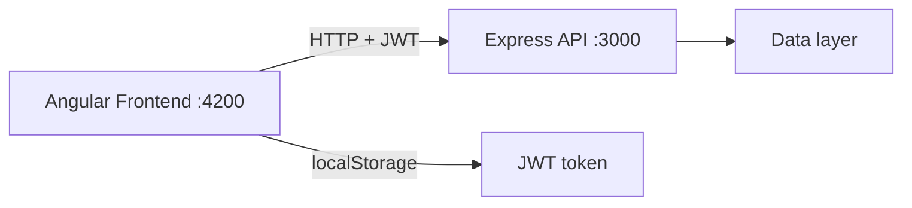
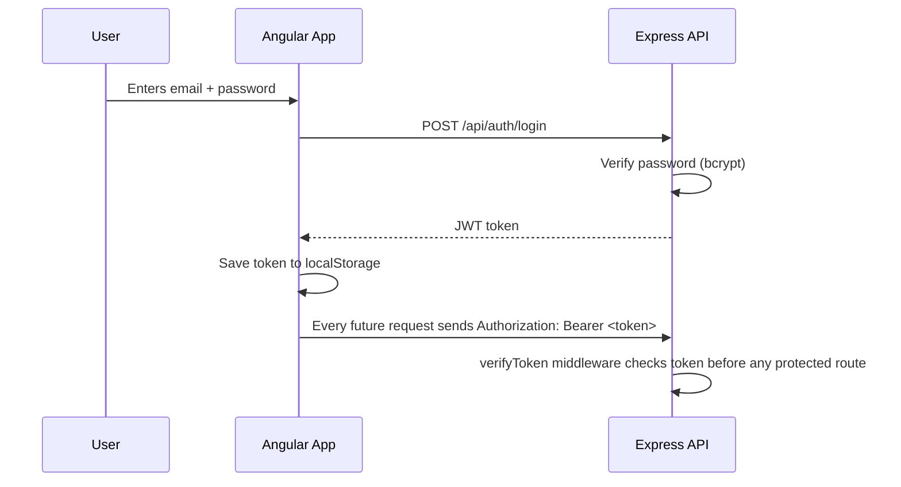
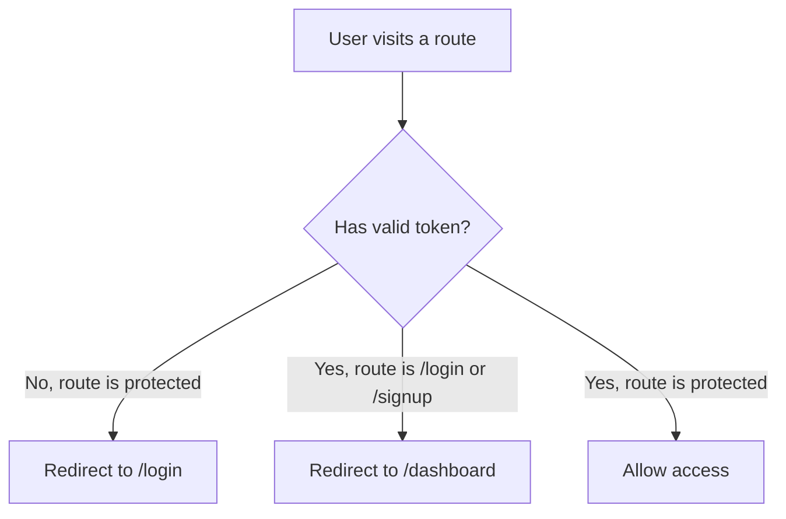

# ResumeFlow 📃

A full-stack resume builder I built during my internship — users can create resumes from templates, track job applications on a kanban board, and share resumes with recruiters via public links.

This repo has both the backend and frontend together, since they're meant to run as one system.

---

## What this project does

ResumeFlow lets a user:

- sign up and log in with real JWT authentication
- build a resume section by section, with a live preview alongside
- pick a look from a gallery of templates
- track job applications through a pipeline (Saved → Applied → Interview → Offer → Rejected)
- generate a public link to share a resume with anyone, no login required on their end
- save named versions of a resume and restore an older one if needed

---

## Project structure

```
ResumeFlow-Submission/
├── backend/     Node.js + Express API
└── frontend/    Angular application (standalone components, signals)
```

---

## How the pieces talk to each other



The frontend never touches the data layer directly — every read and write goes through the API, which checks the JWT on every protected route before doing anything.

---

## Auth flow



---

## Route protection



---

## Prerequisites

- Node.js (v18 or higher)
- npm
- Angular CLI — `npm install -g @angular/cli`

---

## Running the backend

```bash
cd backend
npm install
```

Create a `.env` file inside `backend/` with:

```
PORT=3000
JWT_SECRET=your_secret_key_here
```

Then start it:

```bash
npm start
```

API runs at `http://localhost:3000`.

---

## Running the frontend

Open a second terminal:

```bash
cd frontend
npm install
ng serve
```

App runs at `http://localhost:4200`.

---

## Trying it out

1. Open `http://localhost:4200`.
2. Sign up for a new account — you'll land straight on the dashboard.
3. Go to Templates, pick one, and it'll create a document and drop you into the editor.
4. Add a section, add a few bullets, and watch the preview update live on the right.
5. Open the Sharing tab inside the editor and create a public link.
6. Go to Applications and track a company you're applying to — drag its card between pipeline stages.

---

## Tech stack

**Backend:** Node.js, Express, JWT, bcrypt

**Frontend:** Angular (standalone components, signals-based state, zoneless), TypeScript, SCSS

---

## A few things I hardened along the way

- Replaced a mock auth middleware with real JWT verification on every protected route
- Restricted CORS to the frontend's origin instead of allowing all origins
- Added a global error handler and a 404 handler so the server never leaks a raw stack trace
- Added a write-queue at the data layer so two saves in quick succession can't overwrite each other

---

## Future scope

- Migrate the data layer to a real database (MySQL/Postgres) — didn't have the time to do this safely within the internship window without risking breaking a working system days before submission
- Real export formats (PDF) instead of a plain-text download
- Automated tests for the API routes

---

## Notes for whoever's running this

- The `.env` file isn't committed for obvious reasons — you'll need to create your own with any `JWT_SECRET` value.

---

~tanushree🪼
